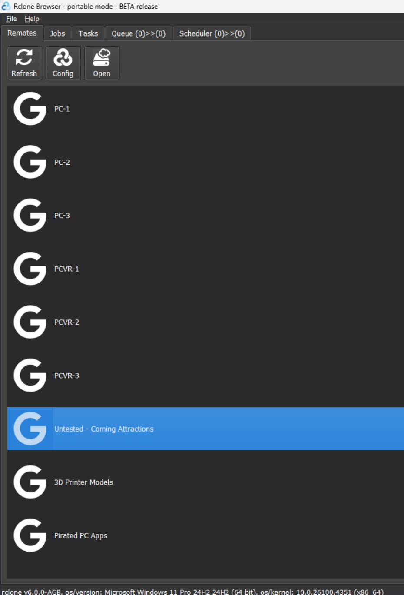
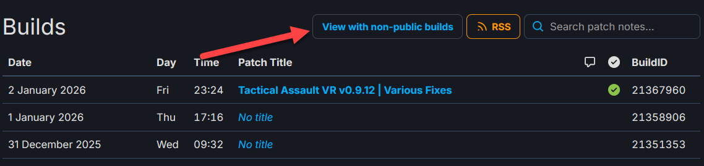
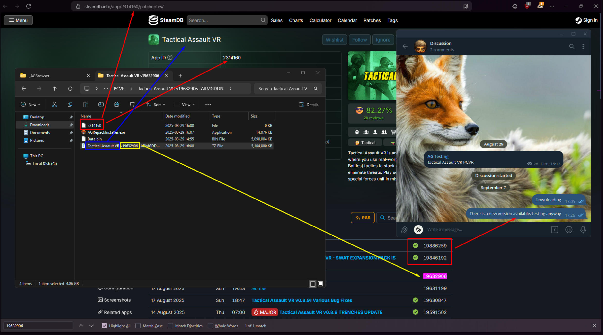
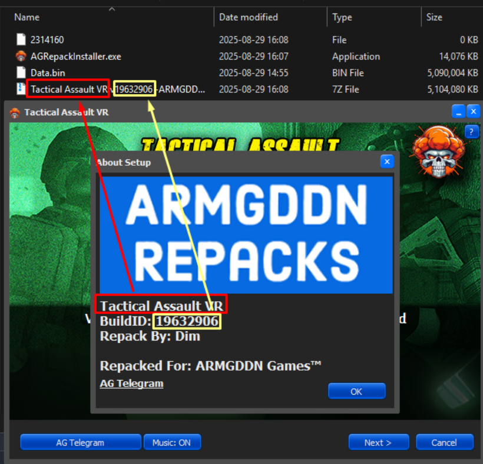
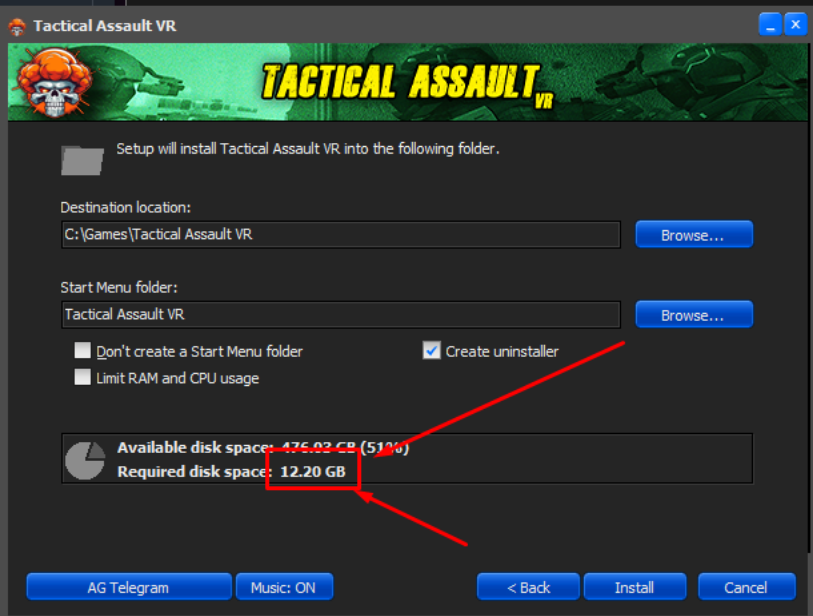
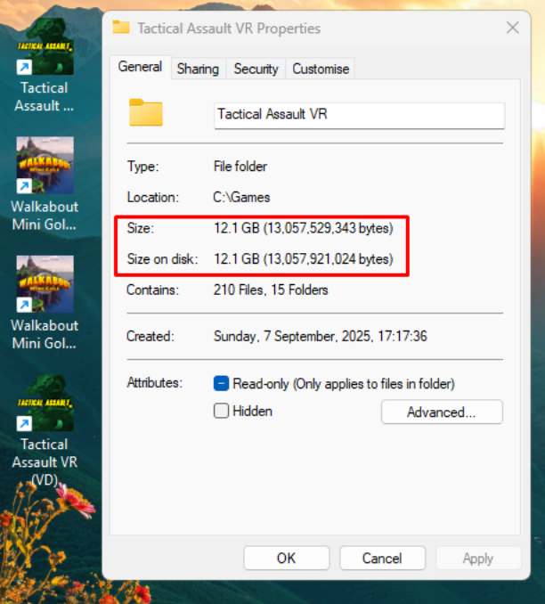
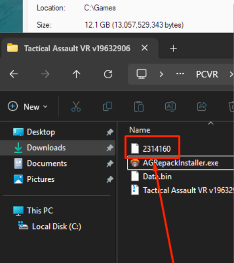

# How to Test ARMGDDN Games

## Step 0 - Pre-requisites
We don't test the games as "ourselves"; we test them as if we were normal users. Therefore, we need to follow the tutorial. For testing, we will always use:
- 7-Zip
- The default folders (C:/Downloads and C:/Games)
- The AV exclusions as the tutorial demands

We will not use anything besides that, such as Open Composite or any other tool that can "mod" the way we play the games.

Also, don't use Steam Link as we do not offer support for this to our users and it causes more problems than it's worth.

I will not teach you how to install or set up anything here, as you should have already watched the tutorial.

## Step 1 - Downloading the browser
I believe you already have it, right? RIGHT???

## Step 2 - Downloading the games
Now that you have the browser installed, let's download a game.

- First, you should check the `AG Testing` channel to see which games need testing.
- Select a game from there. It's good practice to send a message saying that you have taken that game to test.
  - There is no problem with testing a game that has already been tested, but you will usually want to test a non-tested game.
  - **NEVER CLAIM A GAME UNTIL YOU HAVE STARTED TO DOWNLOAD IT**. I know that sometimes life calls and you end up not testing what you claimed, but this can cause other people to skip this game, and it ends up never being tested. Do not claim the game until you are 100% sure you WILL test it on the same day. (It's even better if you claim and test it at the same time).
 
Now that you know the game you want to test, you can open the browser. </br>
You should look for the "Untested - Coming Attractions" mirror; there you will find all games that need testing.
</br>

</br>
Open it, find the game you will test, and simply right-click on it and download it, as you would normally do.

## Step 3 - First checks while the game downloads
To save some time, we can already test some things. Open the folder where the game is being downloaded and you will see the game ID, for example, `2314160` for Tactical Assault VR.
What you need to do is:
- Open https://steamdb.info/app/2314160/patchnotes (Remember to change the ID to the real one you are testing).
- Check if the game that opened is really the one you are testing.
- Check if the patch really exists and if it's the latest one.
 - If it's not the latest one, you can still test, but send a message on Telegram stating that it's not the most recent version.
 - If you can't find the patch you're looking for, first click this button and then search again as somtimes we do non-public builds as well.
 - 
</br>

</br>
If any of this info doesn't match, your test can end here. The repacker must fix the mismatched appids, version, or whatever.

## Step 4 - Installing the game
- Once the game is downloaded, extract it using 7-Zip. You should already know how to do that.
- Open the installer, select the language, and let's go.

Now, there are some obvious things to take note of to see if they are correct:
- The splash screen when opening the installer should match the game.
- The background of the installer should match the game.
- Names and everything else should match the game.

Not-so-obvious things:
- Make sure the AG Telegram button works and redirects to the correct place.
- Make sure the Music button works.
- Click on "?" in the top right corner.
  - Make sure the game name and build ID match.
  - 
  - Make sure the AG Telegram button works and redirects to the correct place.

If there is a mismatch, post it in the replies on Telegram, and you can finish your test here.

You can now click "Next". </br>
Here, write down the required disk space; in my case, "12.20 GB".
</br>

</br>

- Click "Install".
- Make sure all the images in the background are of good quality.
- Make sure the Background button enables/disables the images.

And that's it for now.

## Step 5 - Before starting the game
Remember the size you noted down? Let's check if it matches.
- Open the game's installation folder.
- Right-click on it -> Properties.
- 
- Make sure the size matches (it dosen't have to be exact, just close).
- While you're at it, check if the icons are present and are of good quality.
- Check ALL shortcuts: desktop and start menu ones.

Nice. Now you can open the game folder and take a look. Here are some important things you need to check:
- You can try to find a file called `steam_appid.txt`, sometimes it's in the root folder, sometimes you have to look for it, and sometimes it's not there. 
- The more important thing to check for the test as far as app ID goes is that the file next to the archives matches the app ID. EX: The `2314160` file with no extension. 
- 99% of the time, the `steam_appid.txt` file will be correct if it is required for that repack, but you can still check if you want to.
- Once you've found the no extension app ID file, check that the app ID is correct.
- 
- If you find anything strange or unusual, post it on Telegram.

## Step 6 - Testing the game itself
- Nice, now you can finally open the game. You should NOT use Open Composite or any other tools on the games. Just test it as it is installed, raw.
- To do that, just open the shortcut that best matches your setup—in my case, it's VD (if the game is VR).
- Now, you just need to play for a little while to see if there are any problems.
- Make sure to test all controls (keyboard + mouse AND controller, if possible). (It is also important to test the keymaps here).
- Check if the settings can be changed and if they remain changed after a restart.
- You can also test if the overlay works (Shift + Tab). Some repackers ship with it, while others don't. It's a good test anyway.
- After all that, open the game again and check if it's saving the progress.
- If you find any problems, post them on Telegram. Some problems are repack-related, but some are game-related. In any case, we don't want to release a problematic game.
- Okay, so now that you've tested the game itself, do the same thing AGAIN with all available shortcuts that are possible for you to test. (Don't forget about the start menu ones, too!)

## Step 7 - Filling out the report
You think it's over? THINK AGAIN.
We have a report to fill out now:
```
Internal DLL - When you extract the archives if there is only a .exe file and a data.bin then this is OK, if there is an extra .dll file with those files then this is NOT internal so you'd put NO/NOT OK etc.
Images / Logos / Slideshow - We saw this in steps 4 and 5. Are all images, logos, icons, and everything else OK?
Info Button - We saw this one in step 4. Remember the "?" button? Was it OK?
Installer Music / Buttons / Links - All other items from Step 4 related to the installer itself.
Size / Name of folder / Build id - Remember the size you noted down? Was the folder created correctly? It all goes here.
Shortcuts - Do the desktop shortcuts have icons and do they works as intended? for VR say which shortcuts you used specifically.
Gameplay VR - This one is self-explanatory. Does it work?
Gameplay Flat - If there is a flat version of the game, include this line too.
AppID TXT - This is the stupid no extension file outside the zip. Make sure there is one if its a steam game with a buildid, and that its for the game that was repacked.. the file should be there but also MATCH the games steam appid.. We saw this in step 5. If you found nothing strange and the no extension appid file is present/correct, then OK.

Extra Info/Comments - Anything extra worth saying, and if ANY issues occur take screenshots! your main job if there is an issue is do your best to identify the issues cause and help the repacker FIX it by giving info that is relevant, for example if the shortcut doesnt work make sure to screenshot the target line of the shortcut! Anything else noteworthy. I usually put what I used to test here.
```

For example:
```
Internal DLL - OK
Images / Logos / Slideshow - Low-quality slideshow images, rest are good
Info Button - OK
Installer Music / Buttons / Links - OK
Size / Name of folder / Build id - OK
Shortcuts - The icon is missing for the desktop shorcuts but they work.
Gameplay VR - Not great. The UI is too far away, so when I try to pick up the public phone, for example, I can't read anything. When trying to fill the watering can, I can't open the tap. It's also hard to read the missions, but that was expected.

Extra Info/Comments - The slideshow images should be replaced if possible, the shortcut icon needs fixed, gameplay issues are non-repack related so after those things are fixed this should be good to go. 
```

Great. Now just post it on Telegram and move on to the next game. \o/
